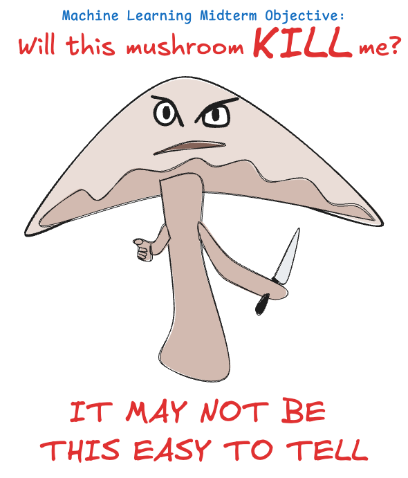

# Midterm Project: Classification Analysis

- **Author**: Aaron Gillespie  
- **Date**: 2025-04-01
- **Objective**: 
  - [ ] build a classifier using machine learning
  - [ ] present the classifier & demonstrate understanding of underlying concepts
  - [ ] document the process
  - [ ] submit as NW Missouri University CSIS 44-670 midterm

## Classifier Objective: Mushroom Safety

We have a dataset about mushrooms, some of which are safe, others not. Our goal is to use machine learning to build a **classifier** capable of predicting whether or not mushrooms are safe.

For additional information regarding the data used, see the Data section at the bottom of this README.

### Steps to the Objective

- Load and explore a dataset.
- Analyze feature distributions and consider feature selection.
- Train and evaluate a classification model.
- Compare different classification approaches.
- Document your work in a structured Jupyter Notebook.

## The Juypter Notebook

[The notebook](midterm_gillespie.ipynb) *(midterm_gillespie.ipynb)* contains the rest of the project documentation.

## Data

The data for this project are sourced from a [UC Irvine repository](https://archive.ics.uci.edu/dataset/73/mushroom). It is comprised of one boolean target feature (`poisonous`) and 22 features which may be used by the classifier to make its predictions. 

| Variable Name            | Role    | Type        | Description                                                                                         | Units | Missing Values |
| ------------------------ | ------- | ----------- | --------------------------------------------------------------------------------------------------- | ----- | -------------- |
| poisonous                | Target  | Categorical |                                                                                                     |       | no             |
| cap-shape                | Feature | Categorical | bell=b,conical=c,convex=x,flat=f, knobbed=k,sunken=s                                                |       | no             |
| cap-surface              | Feature | Categorical | fibrous=f,grooves=g,scaly=y,smooth=s                                                                |       | no             |
| cap-color                | Feature | Binary      | brown=n,buff=b,cinnamon=c,gray=g,green=r, pink=p,purple=u,red=e,white=w,yellow=y                    |       | no             |
| bruises                  | Feature | Categorical | bruises=t,no=f                                                                                      |       | no             |
| odor                     | Feature | Categorical | almond=a,anise=l,creosote=c,fishy=y,foul=f, musty=m,none=n,pungent=p,spicy=s                        |       | no             |
| gill-attachment          | Feature | Categorical | attached=a,descending=d,free=f,notched=n                                                            |       | no             |
| gill-spacing             | Feature | Categorical | close=c,crowded=w,distant=d                                                                         |       | no             |
| gill-size                | Feature | Categorical | broad=b,narrow=n                                                                                    |       | no             |
| gill-color               | Feature | Categorical | black=k,brown=n,buff=b,chocolate=h,gray=g, green=r,orange=o,pink=p,purple=u,red=e, white=w,yellow=y |       | no             |
| stalk-shape              | Feature | Categorical | enlarging=e,tapering=t                                                                              |       | no             |
| stalk-root               | Feature | Categorical | bulbous=b,club=c,cup=u,equal=e, rhizomorphs=z,rooted=r,missing=?                                    |       | yes            |
| stalk-surface-above-ring | Feature | Categorical | fibrous=f,scaly=y,silky=k,smooth=s                                                                  |       | no             |
| stalk-surface-below-ring | Feature | Categorical | fibrous=f,scaly=y,silky=k,smooth=s                                                                  |       | no             |
| stalk-color-above-ring   | Feature | Categorical | brown=n,buff=b,cinnamon=c,gray=g,orange=o, pink=p,red=e,white=w,yellow=y                            |       | no             |
| stalk-color-below-ring   | Feature | Categorical | brown=n,buff=b,cinnamon=c,gray=g,orange=o, pink=p,red=e,white=w,yellow=y                            |       | no             |
| veil-type                | Feature | Binary      | partial=p,universal=u                                                                               |       | no             |
| veil-color               | Feature | Categorical | brown=n,orange=o,white=w,yellow=y                                                                   |       | no             |
| ring-number              | Feature | Categorical | none=n,one=o,two=t                                                                                  |       | no             |
| ring-type                | Feature | Categorical | cobwebby=c,evanescent=e,flaring=f,large=l, none=n,pendant=p,sheathing=s,zone=z                      |       | no             |
| spore-print-color        | Feature | Categorical | black=k,brown=n,buff=b,chocolate=h,green=r, orange=o,purple=u,white=w,yellow=y                      |       | no             |
| population               | Feature | Categorical | abundant=a,clustered=c,numerous=n, scattered=s,several=v,solitary=y                                 |       | no             |
| habitat                  | Feature | Categorical | grasses=g,leaves=l,meadows=m,paths=p, urban=u,waste=w,woods=d                                       |       | no             |